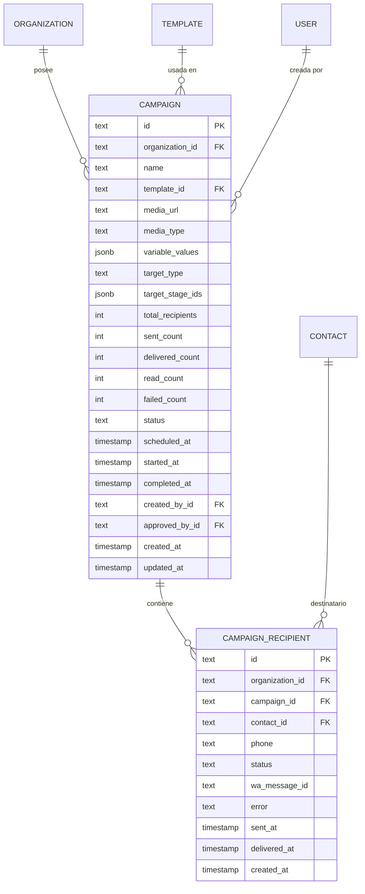

# Modelo de Datos: Campañas y Recordatorios de WhatsApp

**Feature**: `003-campaigns-reminders`  
**Base de Datos**: PostgreSQL 16  
**ORM**: Drizzle ORM  

---

## 1. Diagrama Entidad-Relación



---

## 2. Definición Drizzle ORM (`src/lib/db/schema.ts`)

```typescript
export const campaignStatusEnum = [
  "draft",
  "pending_approval",
  "scheduled",
  "sending",
  "completed",
  "cancelled",
  "failed",
] as const;

export type CampaignStatus = (typeof campaignStatusEnum)[number];

export const campaign = pgTable(
  "campaign",
  {
    id: text("id").primaryKey(),
    organizationId: text("organization_id")
      .notNull()
      .references(() => organization.id, { onDelete: "cascade" }),
    name: text("name").notNull(),
    templateId: text("template_id")
      .notNull()
      .references(() => template.id),
    mediaUrl: text("media_url"),
    mediaType: text("media_type", { enum: ["image", "video", "document"] }),
    variableValues: jsonb("variable_values").$type<Record<string, string>>(),
    targetType: text("target_type", { enum: ["all_contacts", "pipeline_stages"] })
      .notNull()
      .default("all_contacts"),
    targetStageIds: jsonb("target_stage_ids").$type<string[]>(),
    totalRecipients: integer("total_recipients").notNull().default(0),
    sentCount: integer("sent_count").notNull().default(0),
    deliveredCount: integer("delivered_count").notNull().default(0),
    readCount: integer("read_count").notNull().default(0),
    failedCount: integer("failed_count").notNull().default(0),
    status: text("status", { enum: campaignStatusEnum })
      .notNull()
      .default("draft"),
    scheduledAt: timestamp("scheduled_at"),
    startedAt: timestamp("started_at"),
    completedAt: timestamp("completed_at"),
    createdById: text("created_by_id").references(() => user.id, { onDelete: "set null" }),
    approvedById: text("approved_by_id").references(() => user.id, { onDelete: "set null" }),
    createdAt: timestamp("created_at").notNull().defaultNow(),
    updatedAt: timestamp("updated_at").notNull().defaultNow(),
  },
  (t) => [
    index("campaign_org_status_idx").on(t.organizationId, t.status),
    index("campaign_org_scheduled_idx").on(t.organizationId, t.scheduledAt),
  ]
);

export const campaignRecipient = pgTable(
  "campaign_recipient",
  {
    id: text("id").primaryKey(),
    organizationId: text("organization_id")
      .notNull()
      .references(() => organization.id, { onDelete: "cascade" }),
    campaignId: text("campaign_id")
      .notNull()
      .references(() => campaign.id, { onDelete: "cascade" }),
    contactId: text("contact_id")
      .notNull()
      .references(() => contact.id, { onDelete: "cascade" }),
    phone: text("phone").notNull(),
    status: text("status", { enum: ["pending", "sent", "delivered", "read", "failed"] })
      .notNull()
      .default("pending"),
    waMessageId: text("wa_message_id"),
    error: text("error"),
    sentAt: timestamp("sent_at"),
    deliveredAt: timestamp("delivered_at"),
    createdAt: timestamp("created_at").notNull().defaultNow(),
  },
  (t) => [
    index("campaign_recip_camp_status_idx").on(t.campaignId, t.status),
    index("campaign_recip_org_wamid_idx").on(t.organizationId, t.waMessageId),
  ]
);
```
