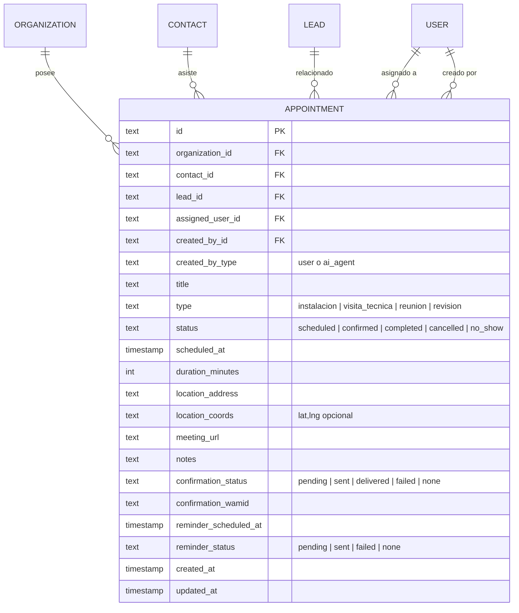

# Modelo de Datos: Módulo de Agenda y Citas

**Feature**: `004-appointments-calendar`  
**Base de Datos**: PostgreSQL 16 (Drizzle ORM)  

---

## 1. Diagrama Entidad-Relación



---

## 2. Esquema Drizzle ORM (`src/lib/db/schema.ts`)

```typescript
export const appointmentTypeEnum = [
  "instalacion",
  "visita_tecnica",
  "reunion",
  "revision",
] as const;

export type AppointmentType = (typeof appointmentTypeEnum)[number];

export const appointmentStatusEnum = [
  "scheduled",
  "confirmed",
  "completed",
  "cancelled",
  "no_show",
] as const;

export type AppointmentStatus = (typeof appointmentStatusEnum)[number];

export const appointment = pgTable(
  "appointment",
  {
    id: text("id").primaryKey(),
    organizationId: text("organization_id")
      .notNull()
      .references(() => organization.id, { onDelete: "cascade" }),
    contactId: text("contact_id")
      .notNull()
      .references(() => contact.id, { onDelete: "cascade" }),
    leadId: text("lead_id").references(() => lead.id, { onDelete: "set null" }),
    assignedUserId: text("assigned_user_id").references(() => user.id, { onDelete: "set null" }),
    createdById: text("created_by_id").references(() => user.id, { onDelete: "set null" }),
    createdByType: text("created_by_type", { enum: ["user", "ai_agent"] })
      .notNull()
      .default("user"),
    title: text("title").notNull(),
    type: text("type", { enum: appointmentTypeEnum })
      .notNull()
      .default("visita_tecnica"),
    status: text("status", { enum: appointmentStatusEnum })
      .notNull()
      .default("scheduled"),
    scheduledAt: timestamp("scheduled_at").notNull(),
    durationMinutes: integer("duration_minutes").notNull().default(60),
    locationAddress: text("location_address"),
    locationCoords: text("location_coords"),
    meetingUrl: text("meeting_url"),
    notes: text("notes"),
    
    // Notificación de confirmación por WhatsApp
    confirmationStatus: text("confirmation_status", {
      enum: ["pending", "sent", "delivered", "failed", "none"],
    }).default("none"),
    confirmationWamid: text("confirmation_wamid"),
    
    // Recordatorio previo automático
    reminderScheduledAt: timestamp("reminder_scheduled_at"),
    reminderStatus: text("reminder_status", {
      enum: ["pending", "sent", "failed", "none"],
    }).default("none"),

    createdAt: timestamp("created_at").notNull().defaultNow(),
    updatedAt: timestamp("updated_at").notNull().defaultNow(),
  },
  (t) => [
    index("appointment_org_scheduled_idx").on(t.organizationId, t.scheduledAt),
    index("appointment_org_status_idx").on(t.organizationId, t.status),
    index("appointment_org_assigned_idx").on(t.organizationId, t.assignedUserId),
    index("appointment_contact_idx").on(t.organizationId, t.contactId),
  ]
);
```
