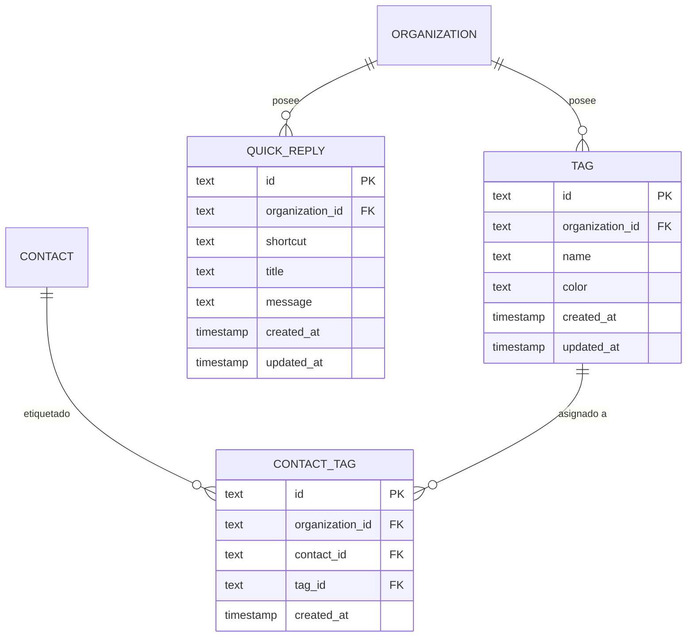

# Modelo de Datos: Respuestas Rápidas y Etiquetas (Tags)

**Feature**: `005-tags-and-quick-replies`  
**Base de Datos**: PostgreSQL 16 (Drizzle ORM)  

---

## 1. Diagrama Entidad-Relación



---

## 2. Esquema Drizzle ORM (`src/lib/db/schema.ts`)

```typescript
export const tag = pgTable(
  "tag",
  {
    id: text("id").primaryKey(),
    organizationId: text("organization_id")
      .notNull()
      .references(() => organization.id, { onDelete: "cascade" }),
    name: text("name").notNull(),
    color: text("color").notNull().default("#3b82f6"), // Hex o clase Tailwind
    createdAt: timestamp("created_at").notNull().defaultNow(),
    updatedAt: timestamp("updated_at").notNull().defaultNow(),
  },
  (t) => [
    uniqueIndex("tag_org_name_uq").on(t.organizationId, t.name),
    index("tag_org_idx").on(t.organizationId),
  ]
);

export const contactTag = pgTable(
  "contact_tag",
  {
    id: text("id").primaryKey(),
    organizationId: text("organization_id")
      .notNull()
      .references(() => organization.id, { onDelete: "cascade" }),
    contactId: text("contact_id")
      .notNull()
      .references(() => contact.id, { onDelete: "cascade" }),
    tagId: text("tag_id")
      .notNull()
      .references(() => tag.id, { onDelete: "cascade" }),
    createdAt: timestamp("created_at").notNull().defaultNow(),
  },
  (t) => [
    uniqueIndex("contact_tag_contact_tag_uq").on(t.contactId, t.tagId),
    index("contact_tag_org_contact_idx").on(t.organizationId, t.contactId),
    index("contact_tag_org_tag_idx").on(t.organizationId, t.tagId),
  ]
);

export const quickReply = pgTable(
  "quick_reply",
  {
    id: text("id").primaryKey(),
    organizationId: text("organization_id")
      .notNull()
      .references(() => organization.id, { onDelete: "cascade" }),
    shortcut: text("shortcut").notNull(), // Ej: "banco", "planes"
    title: text("title").notNull(), // Ej: "Cuentas Bancarias QR"
    message: text("message").notNull(), // Texto completo a insertar
    createdAt: timestamp("created_at").notNull().defaultNow(),
    updatedAt: timestamp("updated_at").notNull().defaultNow(),
  },
  (t) => [
    uniqueIndex("quick_reply_org_shortcut_uq").on(t.organizationId, t.shortcut),
    index("quick_reply_org_idx").on(t.organizationId),
  ]
);
```
